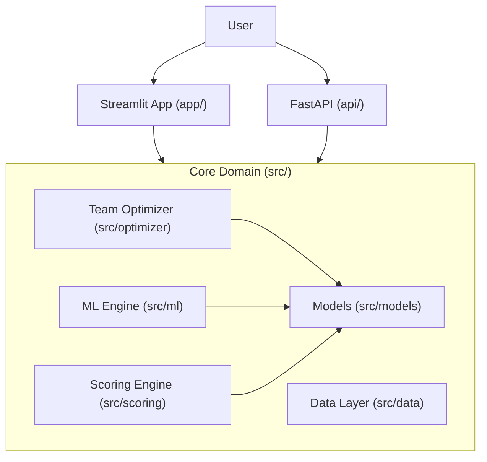

# System Architecture

I designed **CricOptima** with a **Clean, Modular Architecture** to ensure scalability, maintainability, and testability. The system is decoupled into three distinct layers, ensuring that business logic remains independent of the delivery mechanism.

## 🏗️ High-Level Structure

The codebase is organized into three distinct layers:

1.  **Core Domain Layer (`src/`)**: Contains business logic, models, and algorithms. Independent of frameworks.
2.  **API Layer (`api/`)**: The REST interface (FastAPI) that exposes core logic to the world.
3.  **Application Layer (`app/`)**: The frontend interface (Streamlit) for end-users.

## 📂 Directory Breakdown

### `src/` (The Core)
This directory works as a standalone Python package.
-   **`models/`**: Pydantic models defining the domain objects (`Player`, `Team`, `Match`). Strict type validation.
-   **`scoring/`**: The `FantasyScorer` engine that calculates points based on match events.
-   **`optimizer/`**: The `TeamOptimizer` which uses constraint satisfaction (Greedy/Knapsack-style) to build the best team.
-   **`ml/`**: Machine Learning components. `FeatureEngineer` transforms raw stats, and `PlayerPredictor` (Gradient Boosting) forecasts performance.
-   **`data/`**: Data generators and providers. Currently uses synthetic "Sample Data" for demonstration.

### `api/` (The Interface)
A lightweight FastAPI wrapper around the `src` package.
-   **`main.py`**: Defines endpoints (`/optimize`, `/players`, `/predict`).
-   **`schemas.py`**: request/response DTOs (Data Transfer Objects) to keep API contracts separate from internal domain models.

### `app/` (The Dashboard)
A Streamlit web application.
-   Directly imports from `src` to run as a self-contained monolith for easy deployment (e.g., Streamlit Cloud).
-   **Self-Healing**: Automatically trains the ML model on startup if binary files are missing.

## 🔧 Key Design Decisions

1.  **Stateless Core**: The `TeamOptimizer` and `FantasyScorer` are pure classes. They take data in and return results without side effects.
2.  **Type Safety**: Extensive use of Python type hints and Pydantic ensures data integrity across all layers.
3.  **Dependency Isolation**: The API and App layers depend on `src`, but `src` never depends on them.
4.  **Configuration**: Global settings are managed via `src/config.py` using `pydantic-settings`, reading from environment variables.

## 🚀 deployment

The application is containerized using Docker.
-   **Unified Image**: A single `Dockerfile` can run both the API and the Streamlit app.
-   **Orchestration**: `docker-compose.yml` spins up both services for a full local environment.
