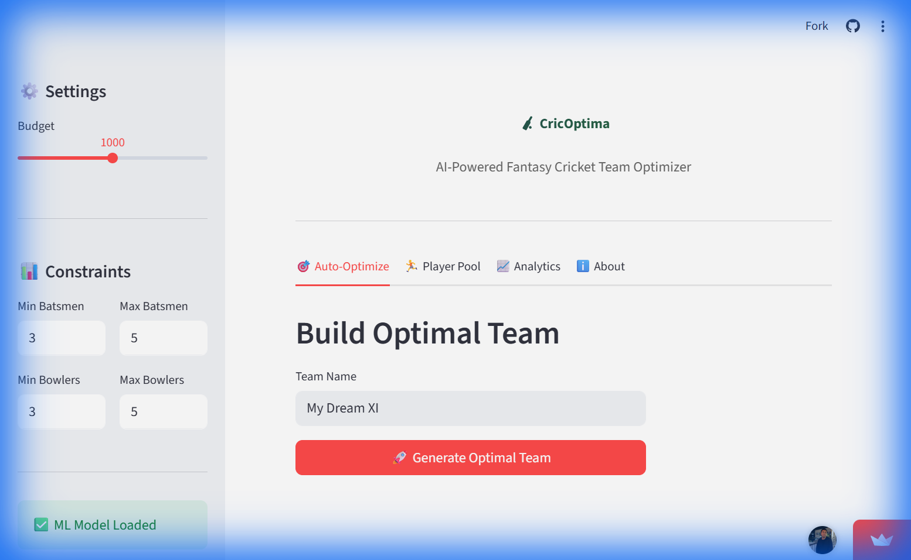
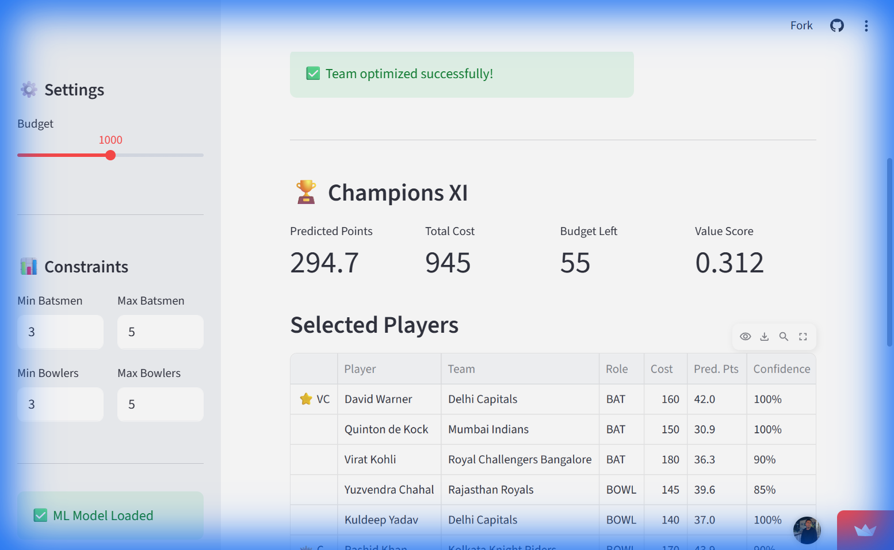

# 🏏 CricOptima

[](https://cricoptima-43y3wvvoj5prwupxqgjxeu.streamlit.app/)


**CricOptima** is an advanced, AI-powered fantasy cricket team optimizer. I designed and built this system to move beyond simple heuristics, implementing **Gradient Boosting** for player performance prediction and mathematical constraint satisfaction for optimal team selection.

🔴 **[LIVE DEMO](https://cricoptima-43y3wvvoj5prwupxqgjxeu.streamlit.app/)** - Experience the AI optimizer in action!

---

## 📚 Documentation

-   **[📖 Deployment Guide](DEPLOYMENT.md)**: How to run this on the web or Docker.
-   **[🏗️ Architecture](ARCHITECTURE.md)**: Deep dive into the clean, modular design.
-   **[🤝 Contributing](CONTRIBUTING.md)**: How to join the project.

---

## 🚀 Key Features

Build optimal fantasy cricket teams using machine learning predictions and constraint optimization algorithms.

## 📸 Screenshots

| **Home** | **Optimization Results** | **Analytics** |
|:---:|:---:|:---:|
|  |  |  |

## ✨ Features

| Feature | Description |
|---------|-------------|
| 🤖 **ML Predictions** | Gradient Boosting model predicts player fantasy points |
| 🎯 **Smart Optimization** | Builds best team within budget and role constraints |
| 📊 **Analytics Dashboard** | Explore player stats, value scores, and predictions |
| 🔌 **REST API** | Full-featured FastAPI backend with Swagger docs |
| 🐳 **Docker Ready** | One-command deployment with docker-compose |

## 🚀 Quick Start

### Option 1: Docker (Recommended)

```bash
# Clone repository
git clone https://github.com/millenniumsingha/CricOptima.git
cd CricOptima

# Train ML model and start services
docker-compose --profile training up train
docker-compose up -d

# Access:
# - Dashboard: http://localhost:8501
# - API Docs:  http://localhost:8000/docs
```

### Option 2: Local Installation

```bash
# Install dependencies
pip install -r requirements.txt

# Train ML model
python -m src.ml.train

# Start API (terminal 1)
uvicorn api.main:app --reload

# Start Dashboard (terminal 2)
streamlit run app/streamlit_app.py
```

## 📊 How It Works

```
┌─────────────────┐     ┌─────────────────┐     ┌─────────────────┐
│   Player Data   │────▶│   ML Predictor  │────▶│   Predictions   │
│   (Stats/Form)  │     │ (Gradient Boost)│     │  (Points/Conf)  │
└─────────────────┘     └─────────────────┘     └────────┬────────┘
                                                         │
                        ┌─────────────────┐              │
                        │    Optimizer    │◀─────────────┘
                        │  (Constraints)  │
                        └────────┬────────┘
                                 │
                        ┌────────▼────────┐
                        │   Optimal XI    │
                        │ (Best Team)     │
                        └─────────────────┘
```

### ML Features Used

- Recent batting/bowling averages
- Strike rate & economy rate
- Form trend (improving/declining)
- Consistency score
- Matches played (experience)

### Optimization Constraints

- Budget limit (default: 1000 points)
- Team size: 11 players
- Min 3 batsmen, 3 bowlers, 1 all-rounder, 1 wicket-keeper
- Max 7 players from same team

## 🔌 API Reference

| Method | Endpoint | Description |
|--------|----------|-------------|
| GET | `/players` | List all players with filters |
| GET | `/players/{id}` | Get single player details |
| POST | `/optimize` | Build optimal team |
| GET | `/predictions` | Get ML predictions |
| POST | `/teams/validate` | Validate team selection |
| GET | `/health` | Health check |

### Example: Get Optimal Team

```bash
curl -X POST "http://localhost:8000/optimize" \
  -H "Content-Type: application/json" \
  -d '{"budget": 1000, "team_name": "My Dream XI"}'
```

## 📁 Project Structure

```
CricOptima/
├── src/
│   ├── models/          # Data models (Player, Team, Match)
│   ├── scoring/         # Fantasy points calculator
│   ├── optimizer/       # Team optimization algorithm
│   ├── ml/              # ML prediction model
│   └── data/            # Data layer & sample data
├── api/                 # FastAPI backend
├── app/                 # Streamlit dashboard
├── tests/               # Test suite
├── ml_models/           # Trained models
└── legacy/              # Original project files
```

## 🧪 Testing

```bash
# Run all tests
pytest tests/ -v

# With coverage
pytest tests/ --cov=src --cov=api
```

## 🎯 Fantasy Scoring Rules

| Category | Points |
|----------|--------|
| Run | 0.5 |
| Four | +1 bonus |
| Six | +2 bonus |
| 50 runs | +10 bonus |
| 100 runs | +20 bonus |
| Wicket | 10 |
| 3-wicket haul | +5 bonus |
| 5-wicket haul | +10 bonus |
| Catch/Stumping/Run-out | 10 |

## ✅ Completed Features (v2.0)

- [x] **Live Integration**: Real-time player data via CricAPI.
- [x] **User Auth**: Secure login/signup with JWT & bcrypt.
- [x] **Team Management**: Save, load, and delete optimized teams.
- [x] **Comparisons**: Head-to-Head win probability predictions.
- [x] **Simulation**: Monte Carlo simulation (1000x) for variance analysis.
- [x] **Mobile First**: Fully responsive UI for all devices.
- [x] **DevOps**: CI/CD pipeline with strict linting and testing.

## 🚀 Future Roadmap (v3.0)

- [ ] **Advanced Analytics**: Player consistency ratings and ROI analysis.
- [ ] **Historical Backtesting**: Validate model against past 5 years of matches.
- [ ] **Leagues**: Create private leagues to compete with friends.
- [ ] **Live Match Tracking**: Real-time fantasy point updates during games.

## 🙏 Acknowledgments

- Original project from Internshala Python Training
- IPL teams and player data
- scikit-learn, FastAPI, and Streamlit communities

---

*Built with ❤️ for cricket fans and data enthusiasts*
